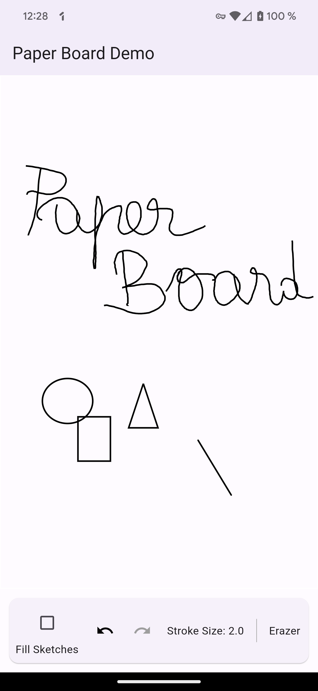

# Paper Board

The goal is to build a powerful and highly customizable drawing board.

## Features
- [x] Draw
- [x] Erase
- [x] Undo
- [x] Redo
- [x] Clear
- [ ] Sketch color
- [x] Save
- [x] Load
- [ ] Zoom
- [ ] Publish on [pub.dev](https://pub.dev/)
 
## TODO
- Add unit tests
- Write documentation
- Add a ColorPicker
- Toolbar needs to be more customizable
- I18n

## Usage



### Installation

Add the following dependency to your `pubspec.yaml` file:

```yaml
dependencies:
  paper_board: 
    git:
      url: https://github.com/stevenosse/paper_board.git
```

### Example

```dart
class HomePage extends StatefulWidget {
  const HomePage({super.key});

  @override
  State<HomePage> createState() => _HomePageState();
}

class _HomePageState extends State<HomePage> {
  final DrawingBoardController controller = DrawingBoardController();

  @override
  Widget build(BuildContext context) {
    return Scaffold(
      appBar: AppBar(
        title: const Text('Paper Board Demo'),
        elevation: 3.0,
      ),
      body: FractionallySizedBox(
        widthFactor: 1.0,
        heightFactor: 1.0,
        child: Column(
          children: [
            Expanded(child: PaperBoard(controller: controller)),
            PaperBoardToolbar(controller: controller),
          ],
        ),
      ),
    );
  }
}
```

## License

This project is licensed under the MIT License - see the [LICENSE](LICENSE) file for details

## Contributing

Fork the project and clone it locally.

```shell
git clone git://github.com/stevenosse/paper_board.git
```

Install dependencies

```shell
cd paper_board
flutter pub get
```

Create a new branch

```shell
git checkout -b feature/my-feature
```

Make your changes and create a pull request.
